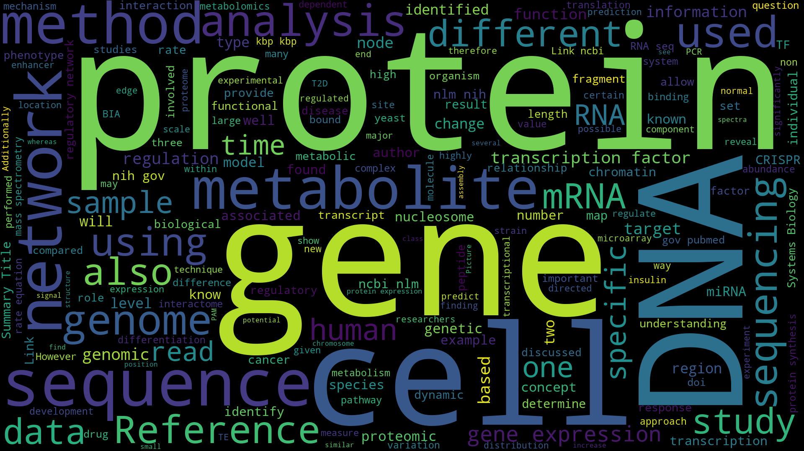

# Systems Biology Wordcloud Generator

[](https://opensource.org/licenses/MIT)

## Introduction

A program that generates a word cloud for Dr. Christine Vogel's 
[Systems Biology Wiki page](https://wikis.nyu.edu/display/Vogel/Systems+Biology).

## Installation

### Disclamer

This depends on `chromedriver` and the Chromium Browser or 
[Google Chrome](https://www.google.com/chrome/browser/desktop/index.html), 
you might have to install both before beginning.

#### Install `chromedriver` for MacOS

```bash
brew install chromedriver
```

#### Install `chromedriver` for Linux

```bash
sudo apt install chromium-chromedriver
```

### Install Package

```bash
git clone https://github.com/zachary822/sysbio_wiki_wordcloud.git
cd sysbio_wiki_wordcloud
python3 setup.py install
```

## Usage

### CLI

```bash
# use the -h option to see detailed description
sysbio_wiki_wordcloud -o [OUTPUT] --width [WIDTH] --height [HEIGHT]
```

### Programmatic

```python
import sysbio_wiki_wordcloud

sysbio_wiki_wordcloud.save_word_cloud("wordcloud.png", width=1920, height=1080)
```

This generates a wordcloud file of specific width and height.

## Result



## License

[MIT](https://github.com/zachary822/sysbio_wiki_wordcloud/blob/master/LICENSE.txt)
